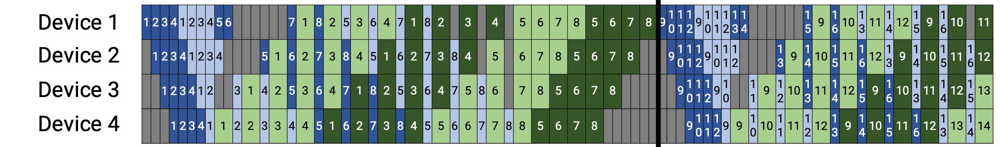
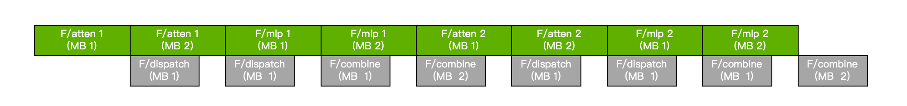

# 1. 方案背景

核心问题: 如何在 GB200 集群上高效训练模型

参考: [Optimizing DeepSeek-V3 Training Performance on NVIDIA GB200 NVL72
](https://github.com/NVIDIA/Megatron-LM/blob/eb0783b6d35607ef1953eaca60b37b886b1a25d0/docs/discussions/deepseek-v3-gb200-optimization/deepseek-v3-gb200-optimization.md)

在 4x GB200 上训练 DeepSeek-V3, 采用 PP = 8, VPP = 4, EP = DP = 32 的并行策略, mbs = 1, gbs = 2048, seq = 4096.

采用 PP 训练会导致导致 pipeline 上存在大量 bubble, 需要增大 micro-batch 数量来降低 bubble.
VPP 进一步分割模型来填充 pipeline, 本质上也是增多 inflight micro-batch 来换取 bubble 的减少, 代价是 activation 进一步增大, 且调度策略更加复杂.

为提高 PP 效率, 通常设置 mbs = 1, 实验表明 mbs = 1 无法在 GB200 上打满吞吐量, 说明 PP 并非最佳策略.
- 大部分算子在 mbs = 1 和 mbs = 2 的完成时间都很接近, 即后者的计算强度更高
- 在 H100 和 GB200 都观察到了相同的现象

GB200 引入了 NVLink-C2C, 实验表明其 CPU-GPU 之间的带宽能够达到 PCIe-5 的 4 倍.

核心思路: 将 GPU 视为纯粹的计算节点, 让数据 "流动起来", 通过将参数、梯度、激活值、优化器状态等动态卸载到 CPU, 在 GPU 上使用更大的 micro-batch size 训练, 来提高计算强度.

----

# 2. 相关工作

**ZeRO-Offload**: 将 optimizer 卸载到 CPU 计算, 需要搬运梯度 (GPU->CPU) 和权重 (CPU->GPU), optimizer 成为瓶颈.
ZeRO-Offload 根据通信量分割计算图:
1. backward 的同时卸载精度为 fp16 的梯度, CPU 接收到梯度后将精度提高为 fp32
2. 在全部梯度卸载后, CPU 做全局检查, 然后开始更新优化器状态
3. 更新过程中, CPU 将 master parameters 转换为 fp16 精度, 加载到 GPU 覆盖原参数

**ZeRO-Infinity**: 将参数、梯度、激活值、优化器状态等卸载到 CPU 和 NVMe 内存, 提出要在做 prefetch 来 overlap GPU<->CPU 和 CPU<->NVMe 之间的通信.

**Super-Offload**: 在 ZeRO-Offload 基础上适配 super chips (GH100) 的高速 C2C 连接.
Super-Offload 认为 CPU<->GPU 的带宽不再是瓶颈, 可以做出优化
1. backward 的同时, 在 GPU 将梯度精度提高为 fp32 后再卸载, 相比较先卸载再转换精度, 能够节省近一半的时间
2. STV 技术允许在未进行全局检查的时候更新优化器状态, 出现异常值后回退, 因此在梯度卸载的同时, CPU 就可以更新优化器状态了
3. Super-Offload 将 optimizer 分割到 CPU 和 GPU 执行, 在 GPU 完成反向传播后可以和 CPU 同时做 optimizer, 还能节省部分在 CPU 和 GPU 之间搬运 parameters 的开销 

ZeRO-Offload 和 Super-Offload 本质是对梯度和 optimizer 卸载的讨论, ZeRO-Infinity 则是对参数卸载效率的讨论, 可以和两种 Offload 技术结合.
Super-Offload 的核心贡献是减少了 CPU 和 GPU 的空闲时间, 但其实 STV 和 optimizer 和 super-chip 的特性并无关系.

这三篇工作集成在 DeepSpeed, 尝试在 4 GB200 上运行几种算法, 都观察到吞吐量随 mbs 增大而提高.

局限性:
1. 三篇工作的核心目标是在单台设备上训练更大的模型, 没有考虑通过卸载来提高计算强度
2. 三篇工作均未支持 MoE 和 EP, DeepSpeed 将 MoE layer 视为一个整体来处理, 这里存在很多优化空间, e.g. forward-forward 来 overlap

----
# 3. 潜在收益分析

实验观察到, 吞吐量随 mbs 增大, 假设吞吐量是随 mbs 增大的单调函数 $\gamma(\mathrm{mbs})$.
对于 EP 通信, 理论上 mbs 增大会将大量小消息通信合并, 带来一定性能提升.

原始方案: 4x GB200 训练 DeepSeek-V3, PP = 8, VPP = 4, EP = DP = 32, gbs = 2048, seq = 4096.
对比方案: 1x GB200 训练 DeepSeek-V3, DP = EP = 64, gbs = 2048, seq = 4096, 将参数、激活值、梯度、优化器状态卸载到 CPU, 全部计算发生在 GPU.
均启用

## 3.1 显存与 mbs 极限值

首先, 从显存角度分析极限 mbs 能够开多大.

单颗 GB200 显存大小为 189471 MiB
假设我们准备双缓冲, 在 buffer[1] 上做 forward 的同时, 可以将下一层参数加载到 buffer[0].param, 同时把存储在 buffer[0].act 卸载到 cpu.

**原始方案**

PP0  total 135.5  GB  (weight_grad 28.0  GB weight_grad_optim 52.64 GB  act 82.86  GB)
PP1  total 140.81 GB  (weight_grad 26.08 GB weight_grad_optim 50.6 GB   act 90.21  GB)
PP2  total 161.62 GB  (weight_grad 26.08 GB weight_grad_optim 58.23 GB  act 103.39 GB)
PP3  total 155.71 GB  (weight_grad 26.08 GB weight_grad_optim 58.23 GB  act 97.49  GB)
PP4  total 152.76 GB  (weight_grad 26.08 GB weight_grad_optim 58.23 GB  act 94.53  GB)
PP5  total 149.81 GB  (weight_grad 26.08 GB weight_grad_optim 58.23 GB  act 91.58  GB)
PP6  total 143.9  GB  (weight_grad 26.08 GB weight_grad_optim 58.23 GB  act 85.67  GB)
PP7  total 123.2  GB  (weight_grad 24.74 GB weight_grad_optim 49.17 GB  act 74.02  GB)

- 采用 fp16 分析
- PP & VPP 调度策略导致 rank[0] 的 inflight micro-batch 显著多于 rank[7].
- embedding layer 和 dense transformer layer 的参数量和激活值比 moe transformer layer 更少, 故 PP2 的显存需求最高.
- mbs = 1 已经占满带宽, 如果增大 mbs 将导致显存不足.

注: 数据参考 megatron_memory_estimator[https://huggingface.co/spaces/ISEEKYAN/megatron_memory_estimator] 计算 (修复了该工具部分统计错误, 仅作为参考)

**对比方案**

param: 0.759 GB, grads: 1.517 GB, optim: 2.009 GB, act: 1.563 GB

- 考虑一层 moe transformer layer 在 mbs = 1 时的显存开销
- 开启 distributed optimizer 后, 加载 optimizer 的成本显著降低
- 假设我们准备双缓冲, 在 buffer[1] 上做 forward 的同时, 可以将下一层参数加载到 buffer[0].param, 同时把存储在 buffer[0].act 卸载到 cpu
- 至多设置 mbs = 48
- 该数据是开启 moe_act recompute 后的数据

---- 

## 3.2 通信与计算 overlap

- forward 期间的通信: 加载下一层参数通信量 $\phi_{f\_\mathrm{load}}$ = 0.759 GB, 卸载上一层 activation 通信量为 $\phi_{f\_\mathrm{offload}}$ = mbs * 1.563 GB
- backward 期间的通信: 加载上一层参数、activation、梯度 (用于求和) $\phi_{b\_\mathrm{offload}}$ = mbs * 1.563 GB + 0.579 GB + 1.517 GB, 卸载下一层 gradients 通信量为 $\phi_{b\_\mathrm{load}}$ = 1.517 GB 
- mbs 较大时, forward 和 backward 的通信量接近, 但 forward 执行时间约为 backward 的一半

通信量随着 mbs 线性增长, 吞吐量 $\gamma(\mathrm{mbs})$ 在 mbs 较小时增长, 在 mbs 达到阈值后不再增长, 即通信耗时与计算耗时成正比, 计算是否能够完全 overlap 通信取决于 $\gamma(\mathrm{mbs})$ 的形状.

- selective recompute 能大量节省 activation

估算得到: forward 计算得到处理一个 mbs = 1, seq = 4096 的序列, MLA 计算量为 2.22 TFlops, Spare MLP 计算量约为 3.247 TFlops.

## 3.3 性能收益

假设 mbs = 1 时 forward / backward 计算量为 $C$ 和 $2C$, alltoall 通信量为 $\phi_{\mathrm{moe}}$, 带宽为 $b_{\mathrm{a2a}}$.

**原始方案**

$M = \mathrm{\frac{gbs}{mbs * dp}} = 2048 / 1 / 32 = 64$

$\eta=\frac{MK}{MK+N-1}=\frac{64 * 4}{64 * 4 + 8 - 1}=97\%$

$t = \frac{M}{N} \times [\frac{3C}{\gamma(1)} + \frac{2\phi_{\mathrm{moe}}}{b_\mathrm{a2a}}]/\eta = \frac{M}{\eta N} \times [\frac{3C}{\gamma(1)} + \frac{2\phi_{\mathrm{moe}}}{b_\mathrm{a2a}}]$

忽略了 p2p 通信.

**对比方案**

$t_f = \mathrm{mbs} \times \max{(\frac{C}{\gamma(\mathrm{mbs})}+\frac{\phi_{\mathrm{moe}}}{b_\mathrm{a2a}},\frac{\phi_{f\_\mathrm{offload}}}{b_{\mathrm{c2c}}})}$

$t_b = \mathrm{mbs} \times \max{(\frac{2C}{\gamma(\mathrm{mbs})}+\frac{\phi_{\mathrm{moe}}}{b_\mathrm{a2a}},\frac{\phi_{b\_\mathrm{load}}}{b_{\mathrm{c2c}}})}$

$M = \mathrm{\frac{gbs}{mbs * dp}} = 2048 / \mathrm{mbs} / 64 = \frac{32}{\mathrm{mbs}}$

$t = (t_f+t_b) \times M + \frac{\phi_\mathrm{opt}}{b_{\mathrm{c2c}}}$

假设理想情况, 我们将卸载和加载的通信完全 overlap, 且加载优化器状态的通信也被 overlap 在计算里面, 优化器执行与 backward 交替执行, 则有

$t =  32[\frac{3C}{\gamma(\mathrm{mbs})} + \frac{2\phi_{\mathrm{moe}}}{b_\mathrm{a2a}}]$

本质上就是在比较原始方案吞吐量和对比方案吞吐量之比为: $\eta[\frac{3C}{\gamma(\mathrm{mbs})} + \frac{2\phi_{\mathrm{moe}}}{b_\mathrm{a2a}}]$ 和 $[\frac{3C}{\gamma(1)} + \frac{2\phi_{\mathrm{moe}}}{b_\mathrm{a2a}}]$

## 3.4 MoE & EP 讨论

- Megatron 在一对 forward 和 backward 之间做 alltoall 的 overlap
- 去掉流水线后, 可以尝试在 forward-forward 和 backward-backward 之间做 alltoall 的 overlap
- 上图为理想情况, 实际上 alltoall 时间可能更长
- alltoall 的同时可以做参数的加载和卸载, 互不影响

对于 alltoall 来说, mbs 不改变通信量, 但可以聚合小消息, 推测 alltoall 速度也与 mbs 相关, 但和 $\gamma(\mathrm{mbs})$ 相比更接近一条直线.

----

# 4. 待测量
