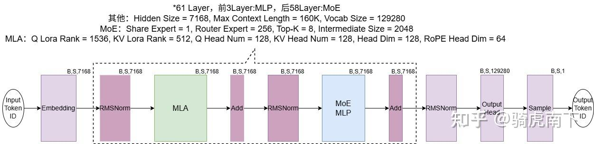
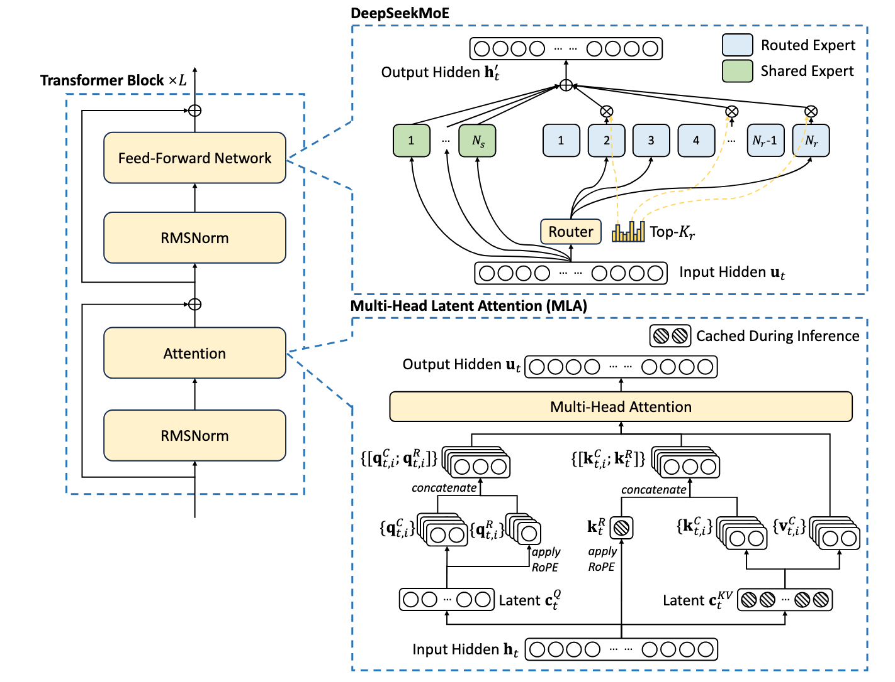

# DeepSeek-V3 训练分析：参数推导、计算量、通信量与显存

## 1. DeepSeek-V3 模型架构参数

### 1.1 模型参数

DeepSeek-V3 采用 MoE (Mixture-of-Experts) + MLA (Multi-Latent Attention) 架构：

| 参数 | 符号 | 值 |
|:---|:---|:---:|
| 词表大小 | $V$ | 129280 |
| 序列长度 | $S$ | 4096 |
| 隐藏维度 | $H$ | 7168 |
| Transformer 层数 | $L$ | 61 |
| MoE 层数（第4~61层） | $L_{moe}$ | 58 |
| Dense 层数（第1~3层） | $L_{dense}$ | 3 |
| 注意力头数 | $n_h$ | 128 |
| 每头维度 | $d_h$ | 128 |
| MLA Q LoRA rank | $r_q$ | 1536 |
| MLA KV LoRA rank | $r_{kv}$ | 512 |
| MLA QK head dim | $d_{qk}$ | 128 |
| MLA QK RoPE head dim | $d_{rope}$ | 64 |
| MLA V head dim | $d_v$ | 128 |
| Dense FFN 隐藏维度 | $h_{\mathrm{ffn}}$ | 18432 |
| Top-K routing | $K$ | 8 |
| Shared expert FFN 隐藏维度 | $h_{shared}$ | 2048 |
| MoE 专家数 | $N_E$ | 256 |
| MoE 专家 FFN 隐藏维度 | $h_{moe}$ | 2048 |

### 1.2 模型架构

```txt
Transformer(
  (embed): ParallelEmbedding()
  (layers): ModuleList(
    (0): Block(
      (attn): MLA(
        (wq): ColumnParallelLinear()
        (wkv_a): Linear()
        (kv_norm): RMSNorm()
        (wkv_b): ColumnParallelLinear()
        (wo): RowParallelLinear()
      )
      (ffn): MLP(
        (w1): ColumnParallelLinear()
        (w2): RowParallelLinear()
        (w3): ColumnParallelLinear()
      )
      (attn_norm): RMSNorm()
      (ffn_norm): RMSNorm()
    )
    (1): Block(
      (attn): MLA(
        (wq): ColumnParallelLinear()
        (wkv_a): Linear()
        (kv_norm): RMSNorm()
        (wkv_b): ColumnParallelLinear()
        (wo): RowParallelLinear()
      )
      (ffn): MoE(
        (gate): Gate()
        (experts): ModuleList(
          (0-63): 64 x Expert(
            (w1): Linear()
            (w2): Linear()
            (w3): Linear()
          )
        )
        (shared_experts): MLP(
          (w1): ColumnParallelLinear()
          (w2): RowParallelLinear()
          (w3): ColumnParallelLinear()
        )
      )
      (attn_norm): RMSNorm()
      (ffn_norm): RMSNorm()
    )
  )
  (norm): RMSNorm()
  (head): ColumnParallelLinear()
)
```





其中，Transformer 架构如图所示

{: width="500"}
---

### 1.3 参数量分析

以下按照 Megatron-LM 仓库中的算子名称，逐层分析各组件的参数量、精度、显存占用和 activation 情况。

---

#### 1.3.1 Embedding Layer

| Module | 精度 | Matrix | Input | Output | 参数量 | 显存大小 (BF16/MXFP8) | 
|:---|:---:|:---:|:---:|:---:|:---:|:---:|
| `word_embeddings` | BF16 | $[V, H]$ | $[B, S]$ | $[B, S, H]$ | 0.927B | 1.85 GB | 


Embedding Layer 将离散的 token ID 转换为连续的向量表示。

**计算流程**
- `word_embeddings` 将输入 token ID 序列 $[B, S]$ 通过查找表操作转换为词向量，数学上等价于 one-hot 向量和矩阵相乘。输入是 token ID 序列，输出是嵌入向量。

**精度分析**
- 不论采用 BF16/MXFP8 训练, Embedding Layer 始终保持原始精度 BF16 训练 (2B/param)。

**Embedding 层总结：**
- 总参数量: $P_{embed} = V \times h = 0.927M$
- 显存占用: $V \times h \times 2B = 1.85 GB$

---

#### 1.3.2 Transformer Layer 

##### 1.3.2.1 MLA (Multi-Latent Attention)

| Module | 精度 | Params | Input | Output | 参数量 | 显存大小 | 公式 |
|:---|:---:|:---:|:---:|:---:|:---:|:---:|:---:|
| `input_layernorm` | BF16 | $\gamma$ & $\beta$ | $[B, S, H]$ | $[B, S, H]$ | 28.672K | - | - |
| `kv_down_proj` | FP8 | $[H, r_{kv}+d_{rope}]$ | $[B, S, H]$ | $[B, S, r_{kv}+d_{rope}]$ | 0.00413B | 3.9375M | (1) + (3) |
| `kv_layernorm` | FP16 | $\gamma$ | $[B, S, r_{kv}]$ | $[B, S, r_{kv}]$ | 512 | - | - |
| `k_up_proj` | FP8 | $[r_{kv}, n_h \cdot d_{qk}]$ | $[B, S, r_{kv}]$ | $[B, S, n_h \cdot d_{qk}]$ | 0.00839B | 8M | (2) |
| `v_up_proj` | FP8 | $[r_{kv}, n_h \cdot d_v]$ | $[B, S, r_{kv}]$ | $[B, S, n_h \cdot d_v]$ | 0.00839B | 8M | (5) |
| apply rope | - | - | $[B, S, d_{rope}]$ | $[B, S, d_{rope}]$ | - | - | (3) |
| `q_down_proj` | FP8 | $[H, r_q]$ | $[B, S, H]$ | $[B, S, r_q]$ | 0.011B | 10.5M | (6) |
| `q_layernorm` | FP16 | $\gamma$ | $[B, S, r_q]$ | $[B, S, r_q]$ | 1536 | - | - |
| `q_up_proj` | FP8 | $[r_q, n_h \cdot (d_{qk} + d_{rope})]$ | $[B, S, r_q]$ | $[B, S, n_h \cdot (d_{qk}+d_{rope})]$ | 0.0377B | 36M | (7) + (8) |
| apply rope | - | - | $[B, S, n_h \cdot d_{rope}]$ | $[B, S, n_h \cdot d_{rope}]$ | - | - | (8) |
| attention | - | - | - | $[B, S, n_h \cdot d_v]$ | - | - | (10) |
| `output_proj` | FP8 | $[n_h \cdot d_v, H]$ | $[B, S, n_h \cdot d_v]$ | $[B, S, H]$ | 0.117B | 112M | (11) |
|residual | - | - | $[B, S, H]$ | $[B, S, H]$ | - | - | - |

**计算流程**

$$
\begin{align}
\mathbf{c}_t^{KV} &= W^{DKV}\mathbf{h}_t, \tag{1} \\
\left[\mathbf{k}_{t,1}^C;\mathbf{k}_{t,2}^C;\dots;\mathbf{k}_{t,n_h}^C\right] = \mathbf{k}_t^C &= W^{UK}\mathbf{c}_t^{KV}, \tag{2} \\
\mathbf{k}_t^R &= \text{RoPE}\!\left(W^{KR}\mathbf{h}_t\right), \tag{3} \\
\mathbf{k}_{t,i} &= \left[\mathbf{k}_{t,i}^C;\mathbf{k}_t^R\right], \tag{4} \\
\left[\mathbf{v}_{t,1}^C;\mathbf{v}_{t,2}^C;\dots;\mathbf{v}_{t,n_h}^C\right] = \mathbf{v}_t^C &= W^{UV}\mathbf{c}_t^{KV}, \tag{5} \\
\mathbf{c}_t^Q &= W^{DQ}\mathbf{h}_t, \tag{6} \\
\left[\mathbf{q}_{t,1}^C;\mathbf{q}_{t,2}^C;\dots;\mathbf{q}_{t,n_h}^C\right] = \mathbf{q}_t^C &= W^{UQ}\mathbf{c}_t^Q, \tag{7} \\
\left[\mathbf{q}_{t,1}^R;\mathbf{q}_{t,2}^R;\dots;\mathbf{q}_{t,n_h}^R\right] = \mathbf{q}_t^R &= \text{RoPE}\!\left(W^{QR}\mathbf{c}_t^Q\right), \tag{8} \\
\mathbf{q}_{t,i} &= \left[\mathbf{q}_{t,i}^C;\mathbf{q}_{t,i}^R\right], \tag{9} \\
\mathbf{o}_{t,i} &= \sum_{j=1}^t \text{Softmax}_j\left(\frac{\mathbf{q}_{t,i}^T \mathbf{k}_{j,i}}{\sqrt{d_h^C + d_h^R}}\right)\mathbf{v}_{j,i}^C, \tag{10} \\
\mathbf{u}_t &= W^O\left[\mathbf{o}_{t,1};\mathbf{o}_{t,2};\dots;\mathbf{o}_{t,n_h}\right], \tag{11} \\
\end{align}
$$

MLA (Multi-Latent Attention) 是 DeepSeek-V3 的核心创新，通过压缩 Q/K/V 来降低推理时的 KV Cache 显存占用和计算开销。与传统 MHA（Multi-Head Attention）相比，MLA 只需保存压缩后的 latent KV cache，而非完整的 head-wise KV。


1. **input_layernorm**: 对输入的 hidden states 归一化，未在公式中体现。

2. **kv_down_proj**: 将 hidden states 压缩到低维 latent space
   - 式 (1) 和式 (3) 都是对 hidden states 降维
   - mcore 将两个 GEMM 合二为一，因此是从 7168 降维至 576 维，然后分为 512 维 (kv_compressed) 和 64 维两个张量 (k_pos_emb)

3. **kv_layernorm**: latent space 对 kv_compressed 上做 RMSNorm

4. **k_up_proj**: latent space 上采样 kv_compressed 扩展到 128-head，每个 head 有 128-dimension，得到 k_no_pe

5. **v_up_proj**: latent space 上采样 kv_compressed 扩展到 128-head，每个 head 有 128-dimension，得到 value

6. **apply_rope**: k_pos_emb 做 rope 旋转，然后与 k_no_pe 拼接得到 key
   - 每个 head 共享同一个 k_pos_emb

7. **q_down_proj**: 将 hidden states 压缩到低维 latent space，得到 q_compressed

8. **kv_layernorm**: latent space 对 q_compressed 上做 RMSNorm

9. **q_up_proj**: 上采样 q_compressed 扩展到 128-head
   - 式 (1) 和式 (3) 都是对 q_compressed 上采样
   - mcore 将两个 GEMM 合二为一，因此是从 1536 上采样至 128 head，每个 head 有 192-dimension
   - q_no_pe 对应前 128-dimension
   - q_pos_emb 对应后 64-dimension

10. **apply_rope**: q_pos_emb 做 rope 旋转，然后与 q_no_pe 拼接得到 query

11. **attention**: 按式 (10) 计算多头 attention

12. **output_proj**：将多头 attention 输出投影回 hidden 维度，得到 attention_output

13. **residual**: 残差为 attention_output 和 x_norm 之和

**完整流程**
```
hidden_states [s, b, 7168]
    │
    ├─→ [1] Layer Normal (LayerNorm, BF16)
    │      │
    │      └─→ input_layernorm(hidden_states) → x_normed [s, b, 7168]
    |
    ├─→ [2] MLA Self-Attention
    │      │
    │      ├─→ QKV Down Projection
    │      │      x_normed [s, b, 7168]
    │      │         ├─→ q_down_proj (GEMM, FP8) → q_compressed [s, b, 1536]
    │      │         └─→ kv_down_proj (GEMM, FP8) → kv_combined [s, b, 576]
    │      │                                           ↓ split
    │      │                 kv_compressed [s, b, 512] & k_pos_emb [s, b, 64]
    │      │
    │      ├─→ QKV Layernorm (LayerNorm, BF16)
    │      │      q_layernorm(q_compressed) → q_normed [s, b, 1536]
    │      │      kv_layernorm(kv_compressed) → kv_normed [s, b, 512]
    │      │
    │      ├─→ Q Up Projection
    │      │      q_normed [s, b, 1536]
    │      │         └─→ q_up_proj (GEMM, FP8) → q [s, b, 128*(128+64)]
    │      │                                     ↓ split
    │      │               q_no_pe [s, b, n*128] & q_pos_emb [s, b, 128*64]
    │      │      q_pos_emb [s, b, 128*64]
    │      │         ↓ apply_rope
    │      │         q_pos_emb_rotated = q_pos_emb * cos + rotate(q_pos_emb) * sin
    │      │         ↓ concat
    │      │         query = concat(q_no_pe, q_pos_emb_rotated) [s, b, 128*(128+64)]
    │      │             
    │      ├─→ KV Up Projection
    │      │      kv_normed [s, b, 512]
    |      |         ├─→ v_up_proj (GEMM, FP8) → v       [s, b, 128*128]
    │      │         └─→ k_up_proj (GEMM, FP8) → k_no_pe [s, b, 128*128]
    │      │      k_pos_emb [s, b, 64] 
    │      │         ↓ apply_rope
    │      │         k_pos_emb_rotated = k_pos_emb * cos + rotate(k_pos_emb) * sin
    │      │         ↓ concat
    │      │         key = concat(k_no_pe, k_pos_emb_rotated) [s, b, 128*(128+64)]
    │      │
    │      ├─→ Core Attention
    │      │      attention_output = softmax(Q @ K^T / sqrt(d)) @ V
    │      │                    [s, b, n*128]
    │      │
    │      └─→ Output Projection
    │             attention_output [s, b, n*128]
    │                └─→ linear_proj (GEMM, FP8) → attn_output [s, b, 7168]
    │
    │
    └─→ [3] Residual + Dropout
            hidden_states = attn_output + x_normed
              └─→ dropout [s, b, 7168]
```

**MLA 性能分析**

在推理时，MHA 需要保存完整的 KV cache，而 MLA 只需要保留式 (1) 中的 $\mathbf{c}_t^{KV}$ 和式 (3) 中的 $\mathbf{k}_t^R$。
- MHA 需要保存 key 和 value 张量，二者规模为 [S, B, 128, 128] 
- MLA 需要保存 latent tensor，同时包含了 key 和 value 的 low rank 信息，规模为 [S, B, 512]，将 KV cache 降低至 3.12%，但推理时需要上采样还原 key 和 value。
- 此外, MLA 还需要保存 k_pos_emb (只和 hidden status 相关), 规模为 [s, b, 64] 

**小结**
- 使用 MXFP8 训练时，处理 LayerNorm 使用 BF16 精度外，其余 parameters 均可使用 MXFP8 存储
- 单个 MLA 所有 Linear 权重参数量为 0.18661B，所有 Linear 权重占用显存大小为 178.4375M


---

##### 1.3.2.2 MLP (Dense Transformer Layer)
| Module | 精度 | Params | Input | Output | 参数量 | 显存大小 |
|:---|:---:|:---:|:---:|:---:|:---:|:---:|
| `input_layernorm` | BF16 | $\beta$ | $[B, S, H]$ | $[B, S, H]$ | - | - | - |
| `mlp.linear_fc1` | FP8 | $[H, 2 \cdot h_{\mathrm{ffn}}]$ | $[B, S, H]$ | $[B, S, 2 \cdot h_{\mathrm{ffn}}]$ | 0.264B | 252M 
| `mlp.activation_func` | - | - | $[B, S, h_{\mathrm{ffn}}]$ | $[B, S, h_{\mathrm{ffn}}]$ | 0 | 0 |
| `mlp.linear_fc2` | FP8 | $[h_{\mathrm{ffn}}, H]$ | $[B, S, h_{\mathrm{ffn}}]$ | $[B, S, H]$ | 0.132B | 126M |

**计算流程**

$$
\text{SwiGLU}(\boldsymbol{x}) = \text{Swish}(\boldsymbol{W}_1 \boldsymbol{x} + \boldsymbol{b}_1) \otimes (\boldsymbol{W}_2 \boldsymbol{x} + \boldsymbol{b}_2)
$$

$$
\text{Swish}(x) = x \cdot \sigma(x)
$$


```
hidden_states [s, b, 7168]
    │
    ├─→ [1] Layer Normal (LayerNorm, BF16)
    │      │
    │      └─→ input_layernorm(hidden_states) → x_normed [s, b, 7168]
    |
    ├─→ [2] FFN layer
    |          x_normed [s, b, 7168]
    |             └─→ linear_fc1 → x_gate [s, b, 18432] & x_up [s, b, 18432]
    |          x_gate [s, b, 18432]
    |             └─→ activation_func (Swish) → x_gate [s, b, 18432]
    |          x = x_gate * x_up → x
    |             └─→ 逐元素相乘 [s, b, 18432]
    |          x [s, b, 18432]
    |             └─→ linear_fc2 → x [s, b, 7168]
    └─→ [3] Residual + Dropout
            hidden_states = attn_output + x_normed
              └─→ dropout [s, b, 7168]
```


Dense FFN 使用 SwiGLU（Swish-Gated Linear Unit）激活函数，这是 LLaMA 等现代大模型的标准选择，相比 ReLU 提供更好的非线性表达能力。第 1-3 层使用 Dense FFN 而非 MoE，因为模型底层的特征提取能力更重要。

**小结**
- 单MLP中，Linear 权重的参数量为 0.396B，Linear 权重占用显存大小为 378M


#### 1.3.2.3 MoE (Sparse  Transformer Layer)
MoE FFN 包含 Router、Routed Experts 和 Shared Expert，使用 GroupedGEMM 优化。每个 token 被路由到 Top-K 个专家，其余专家不参与计算，显著降低计算量。

| Module | 精度 | Params | Input | Output | 参数量 | 显存大小 (BF16/MXFP8) |
|:---|:---:|:---:|:---:|:---:|:---:|:---:|
| `router.linear` | BF16 | $[N_E, H]$ | $[B \cdot S, H]$ | $[B \cdot S, N_E]$ | 0.00183B | - |
| `router.bias` | BF16 | $[N_E]$ |  $[B \cdot S, H]$ | $[B \cdot S, H]$ | 256 | - |

- router.linear 计算每个 expert 处理的概率
- router.bias 添加偏置，避免总是选择相同的专家
   - bias 可以采用启发式算法得到，惩罚最近被选到的 expert
   - bias 也可以是可学习的参数
- router 还要经过 sigmoid 激活、topK、normalization 得到 expert 权重

| Module | 精度 | Params | Input | Output | 参数量 | 显存大小 |
|:---|:---:|:---:|:---:|:---:|:---:|:---:|
| `expert.linear_fc1` | FP8 | $[H, 2 \cdot h_{moe}]$ | $[B, S, H]$ | $[B, S, 2 \cdot h_{\mathrm{ffn}}]$ | 0.02936B | 28M 
| `expert.activation_func` | - | - | $[B, S, h_{moe}]$ | $[B, S, h_{\mathrm{ffn}}]$ | 0 | 0 |
| `expert.linear_fc2` | FP8 | $[h_{moe}, H]$ | $[B, S, h_{\mathrm{ffn}}]$ | $[B, S, H]$ | 0.01468B | 14M |

**小结**
- 和 FFN 相同，MoE 层也要经过 layer normal 和 residual
- router expert 的输出经 router 加权和 shared expert 的输出求和
- 单个 expert 参数量为 0.04404B
- 单个 MoE 中，共 1 router linear，1 shared expert 和 256 router expert，参数量为 11.32B，但实际激活量为 0.3982B
- 通常 router 要采用高精度计算

具体流程如下
1. **Router 计算与 Top-K 选择**：对每个 token 计算路由分数，选择 Top-K 专家
   $$S = X \cdot W_{router}^T + b_{router}, \quad S \in \mathbb{R}^{B \cdot L \times N_E}$$
   $$\text{topk\_indices}, \text{topk\_weights} = 	ext{TopK}(S, K=8)$$
   Router 参数：$W_{router} \in \mathbb{R}^{N_E \times h}$，$b_{router} \in \mathbb{R}^{N_E}$。

2. **Token Dispatch (EP All-to-All)**：根据 EP 分布将 tokens 发送到对应 GPU
   每个 GPU 本地持有 $N_E/EP = 256/32 = 8$ 个专家，通过 all-to-all 通信路由 tokens。

3. **Routed Experts 计算**：使用 GroupedGEMM 并行计算多个专家
   $$Y_{routed} = 	ext{GroupedGEMM}(X_{dispatched}, W_{experts})$$
   GroupedGEMM 将多个小 GEMM 合并为一个大 GEMM，提高计算效率。

4. **Shared Expert 计算**：所有 tokens 都经过共享专家
   $$Y_{shared} = X_{norm} \cdot W_{shared}$$
   Shared expert 提供全局知识，确保每个 token 都能访问完整信息。

5. **Token Combine (EP All-to-All)**：将专家输出路由回原 GPU
   $$Y_{combined} = 	ext{Combine}(Y_{routed}, Y_{shared})$$

6. **加权求和**：根据路由权重合并专家输出
   $$Y = \sum_{i=1}^{K} w_i \cdot Y_i + Y_{shared}$$

7. **Residual Connection**
   $$X_{out} = X + Y$$

#### 1.3.3 Output Layer

Output Layer 将最后一层的 hidden states 投影到词表空间，用于计算下一个 token 的概率分布。

| Module | 精度 | Matrix | Input | Output | 参数量 | 显存大小 (BF16/MXFP8) | 
|:---|:---:|:---:|:---:|:---:|:---:|:---:|
| `output` | BF16 | $[V, H]$ | $[B, S]$ | $[B, S, H]$ | 0.927B | 1.85 GB | 

DeepSeek-V3 的 output layer 共享 embedding layer 参数


#### 1.3.4 组件参数量汇总
| Module | Params | Activated | 层数 | Toal Params | Total Activated |
|:---|:---:|:---:|:---:| :---: | :---: |
| Embedding | 0.927B | ~ | 1 | 0.927B | 0.927B |
| MLA Attention | 0.18661B | ~ |  61 | 11.38B |11.38B |
| MLP | 0.396B | ~ | 3| 1.188B | 1.188B | 
| MoE | 11.32B | 3.965B | 58 | 656.56B | 23.095B |
| Output | 0.927B | ~ | 1 | 0.927B | 0.927B |
| 总计 | - | - | - | ~671B | ~37B |


## 4. Megatron-LM GB200 训练配置分析

### 4.1 NVIDIA 官方配置

基于 Megatron-LM 的 DeepSeek-V3 GB200 训练复现指南：

| 配置项 | 值 | 说明 |
|--------|-----|------|
| GPU 类型 | GB200 (Blackwell) | NVL72 机架 |
| TP | 1 | 无张量并行 |
| PP | 8 | 8 级流水线 |
| VPP | 4 | Virtual Pipeline Parallel |
| EP | 32 | 32-way 专家并行 |
| CP | 1 | 无上下文并行 |
| MBS | 1 | micro-batch size = 1 |
| GBS | 2048 | global batch size |
| 序列长度 | 4096 | |
| 精度 | BF16 + MXFP8 (e4m3) | GEMM 使用 MXFP8 |
| Optimizer | Adam, FP32 params/grads, BF16 momentum/variance | precision-aware optimizer |
| 激活重计算 | selective (moe_act, mlp) | |
| CUDA Graphs | partial (attn, moe_router, moe_preprocess) | |
| PP layout | `"Et\|(tt\|)*30L"` | 32 stages |

### 4.2 并行度推导

$$N_{GPU} = TP \times PP \times EP \times DP$$

$$DP = \frac{N_{GPU}}{TP \times PP \times EP} = \frac{N_{GPU}}{1 \times 8 \times 32} = \frac{N_{GPU}}{256}$$

因此最小 GPU 数量 = 256（此时 DP=1）。

GBS = 2048, MBS = 1, micro-batch 数量 $m$：

$$m = \frac{GBS}{DP \times MBS} = \frac{2048}{DP}$$

当 DP=1 时，$m=2048$（足以掩盖 PP bubble）。
当 DP=8 时（$N_{GPU}=2048$），$m=256$。

### 4.3 PP Layout 分析

```
"Et|(tt|)*30L" → 32 stages
Stage 0:  Embedding + 1 transformer layer
Stage 1-30: 每 stage 2 transformer layers (30 stages)
Stage 31: Loss layer
总层数: 1 + 30×2 = 61 ✓
```

VPP=4 情况下，每个 GPU 持有 PP/VPP = 8/4 = 2 个 virtual stage，每个 virtual stage 包含约 $61/(8 \times 4) \approx 2$ 层。

Bubble 比例（VPP 优化后）：
$$\text{Bubble} = \frac{PP - 1}{m \times VPP} = \frac{7}{m \times 4}$$

当 $m=2048$（DP=1）时，Bubble $= 7/8192 \approx 0.085\%$，可忽略。

---

## 5. 理论推导：通用符号表示

### 5.1 变量定义

| 符号 | 含义 |
|------|------|
| $h$ | 隐藏维度 |
| $L$ | 总层数 |
| $L_{dense}$, $L_{moe}$ | Dense/MoE 层数 |
| $N_E$ | 专家总数 |
| $K$ | top-K routing |
| $h_{\mathrm{ffn}}$ | Dense FFN 隐藏维度 |
| $h_{moe}$ | Expert FFN 隐藏维度 |
| $s$ | 序列长度 |
| $b$ | micro-batch size |
| $B$ | global batch size |
| $N$ | 总 GPU 数 |
| $p_{tp}, p_{pp}, p_{ep}, p_{dp}$ | TP, PP, EP, DP 并行度 |
| $\beta$ | 每参数字节数 (BF16=2, FP8=1, FP32=4) |
| $B_{c2c}$ | CPU-GPU C2C 带宽 (GB/s) |
| $B_{nvl}$ | GPU 间 NVLink 带宽 (GB/s) |
| $B_{net}$ | 机间网络带宽 (GB/s) |

### 5.2 每 GPU 参数量（通用）

**Attention 参数/GPU**（TP 分片）：
$$P_{attn/gpu} = \frac{P_{attn}}{p_{tp}}$$

**Dense FFN 参数/GPU**（TP 分片）：
$$P_{ffn,dense/gpu} = \frac{P_{ffn,dense}}{p_{tp}}$$

**MoE Expert 参数/GPU**（EP + TP 分片）：
$$P_{expert/gpu} = \frac{N_E \times P_{expert}}{p_{ep} \times p_{tp}}$$

**每 GPU 总模型参数**：
$$P_{gpu} = L \times \frac{P_{attn}}{p_{tp}} + L_{dense} \times \frac{P_{ffn,dense}}{p_{tp}} + L_{moe} \times \left(\frac{N_E \times P_{expert}}{p_{ep} \times p_{tp}} + \frac{P_{shared}}{p_{tp}} + P_{router}\right)$$

（PP 情况下，每 GPU 只持有 $L/p_{pp}$ 层）

### 5.3 计算量（FLOPs）

#### 5.3.1 单 token 前向 FLOPs（通用公式）

**Attention 每层**：
- MLA 压缩/解压缩 + QKV 计算：
$$F_{attn,proj} = 2 \times (h \times r_{kv} + r_{kv} \times n_h \times (d_{qk} + d_v) + h \times r_q + r_q \times n_h \times d_{qk} + n_h \times d_v \times h)$$
$$= 2 \times P_{attn}$$

- Attention score 计算（$QK^T$ 和 $\text{score} \times V$）：
$$F_{attn,score} = 2 \times 2 \times n_h \times s \times (d_{qk} + d_{rope}) + 2 \times n_h \times s \times d_v$$

$$\approx 4 \times n_h \times s \times d_{qk}$$

（简化，因 $d_{rope}$ 相对较小，且 V 的维度等于 $d_{qk}$）

**Dense FFN 每层 (SwiGLU)**：
$$F_{ffn,dense} = 2 \times 3 \times h \times h_{\mathrm{ffn}} = 6 \times h \times h_{\mathrm{ffn}}$$

**MoE FFN 每层**：
- 每 token 激活 $K$ 个 expert：
$$F_{moe} = K \times 2 \times 3 \times h \times h_{moe} + 2 \times 3 \times h \times h_{shared}$$
$$= 6h \times (K \times h_{moe} + h_{shared})$$

- Router：
$$F_{router} = 2 \times h \times N_E$$

**每 token 前向总 FLOPs**：
$$F_{fwd/token} = L \times (2P_{attn} + F_{attn,score}) + L_{dense} \times 6h \cdot h_{\mathrm{ffn}} + L_{moe} \times [6h(K \cdot h_{moe} + h_{shared}) + 2h \cdot N_E]$$

**反向 FLOPs** $\approx 2 \times$ 前向：
$$F_{bwd/token} = 2 \times F_{fwd/token}$$

**单 token 训练总 FLOPs**：
$$F_{train/token} = 3 \times F_{fwd/token}$$

#### 5.3.2 每步总 FLOPs

$$F_{step} = B \times s \times F_{train/token}$$

### 5.4 通信量（通用公式）

#### 5.4.1 EP All-to-All 通信

每层 MoE 的 token dispatch + combine（前向 + 反向）：

前向 dispatch: 每 GPU 发送 tokens 到对应 expert 所在 GPU
$$V_{ep,fwd} = 2 \times b \times s \times h \times \beta_{comm}$$

（factor 2: dispatch + combine；每个 token 的 hidden state $h$ 维度需发送）

实际上考虑到 top-K routing，每个 token 发送 K 次但分散到 $p_{ep}$ 个 GPU：
$$V_{ep,fwd/gpu} = 2 \times b \times s \times K \times h \times \beta_{comm} \times \frac{p_{ep}-1}{p_{ep}}$$

反向通信量等于前向：$V_{ep,bwd} = V_{ep,fwd}$

MoE 层 EP 总通信量/step/GPU（前向+反向）：
$$V_{ep} = 2 \times L_{moe} \times V_{ep,fwd/gpu}$$

$$= 4 \times L_{moe} \times b \times s \times K \times h \times \beta_{comm} \times \frac{p_{ep}-1}{p_{ep}}$$

#### 5.4.2 DP All-Reduce 梯度通信

Dense 参数梯度 all-reduce (across $p_{dp}$)：
$$V_{dp,dense/gpu} = 2 \times (L \times P_{attn} + L_{dense} \times P_{ffn,dense} + L_{moe} \times P_{shared}) \times \beta_{grad} \times \frac{p_{dp}-1}{p_{dp}}$$

Expert 参数梯度 all-reduce (across $p_{dp,outer}$ where $p_{dp,outer} = p_{dp}$)：
$$V_{dp,expert/gpu} = 2 \times \frac{L_{moe} \times N_E \times P_{expert}}{p_{ep}} \times \beta_{grad} \times \frac{p_{dp}-1}{p_{dp}}$$

DP 总通信量：
$$V_{dp} = V_{dp,dense/gpu} + V_{dp,expert/gpu}$$

#### 5.4.3 PP 通信

PP stage 间前向/反向 activation 传输：
$$V_{pp/gpu} = 2 \times b \times s \times h \times \beta_{act}$$

（前向传 activation，反向传 gradient；每个 micro-batch）

$m$ 个 micro-batch：
$$V_{pp,total/gpu} = 2m \times b \times s \times h \times \beta_{act}$$

#### 5.4.4 CPU-GPU C2C 通信（本方案卸载）

模型参数加载（前向 + 反向各加载一次）：
$$V_{c2c,param} = 2 \times P_{gpu} \times \beta_{param}$$

梯度回传（backward 后送回 CPU）：
$$V_{c2c,grad} = P_{gpu} \times \beta_{grad}$$

Optimizer 更新后参数回传（与下步 forward 合并）：
$$V_{c2c,update} = P_{gpu} \times \beta_{param}$$

C2C 总通信量/step/GPU：
$$V_{c2c} = 2 \times P_{gpu} \times \beta_{param} + P_{gpu} \times \beta_{grad} + P_{gpu} \times \beta_{param}$$
$$= P_{gpu} \times (3\beta_{param} + \beta_{grad})$$

### 5.5 显存占用（通用公式）

#### 5.5.1 模型参数显存

$$M_{param} = P_{gpu} \times \beta_{param}$$

PP 情况下仅持有 $L/p_{pp}$ 层：
$$M_{param}^{PP} = \frac{P_{gpu}}{p_{pp}} \times \beta_{param}$$

#### 5.5.2 梯度显存

与模型参数等大（同精度）：
$$M_{grad} = M_{param}$$

#### 5.5.3 Optimizer 状态显存

标准 Adam (FP32 全精度)：
$$M_{opt} = P_{gpu,opt} \times (4 + 4 + 4) = 12 \times P_{gpu,opt} \quad \text{bytes}$$

其中 $P_{gpu,opt}$ 是该 GPU 上 optimizer 负责的参数量（ZeRO-1 分片后 $= P_{gpu} / p_{dp}$）。

Megatron-LM 精度感知 optimizer (FP32 params/grads + BF16 m/v)：
$$M_{opt}^{PA} = P_{gpu,opt} \times (4 + 4 + 2 + 2) = 12 \times P_{gpu,opt} \quad \text{bytes}$$

（总量相同，但 momentum/variance 用 BF16 减少了访存瓶颈）

#### 5.5.4 Activation 显存

每层 activation（无重计算）：
$$M_{act/layer} = b \times s \times (C_1 \times h + C_2 \times n_h \times s \times d_h)$$

其中 $C_1, C_2$ 是与具体实现相关的常数。

简化估计（selective recompute moe_act + mlp，仅保存 attention 输出和少量中间值）：

$$M_{act/layer} \approx b \times s \times h \times \beta_{act} \times c_{recomp}$$

其中 $c_{recomp}$ 是重计算因子（selective recompute 下约 2-4）。

PP 需保存多个 micro-batch：
$$M_{act}^{PP} = m_{inflight} \times \frac{L}{p_{pp}} \times M_{act/layer}$$

无 PP 仅需保存 1 个 micro-batch 的逐层 activation（逐层释放）。

---

## 6. DeepSeek-V3 具体值代入计算

### 6.1 Megatron-LM 方案（PP=8, EP=32, TP=1, 256 GPU）

#### 6.1.1 每 GPU 参数量

$$p_{dp} = \frac{256}{1 \times 8 \times 32} = 1$$

每个 PP stage 持有 $61/8 \approx 7-8$ 层（VPP 优化后更均衡）。

近似取每 GPU 持有 8 层（含 MoE 层和可能的 Dense 层）。

PP stage 内每 GPU 参数：
- Attention: $8 \times 174M = 1,392M$
- Expert (EP=32): $8 \times \frac{256 \times 44M}{32} = 8 \times 352M = 2,816M$
- Shared Expert: $8 \times 44M = 352M$
- Dense FFN (仅前 3 层，部分 stage): $\leq 3 \times 396M = 1,188M$ (仅 stage 0 有)

$$P_{gpu}^{megatron} \approx 1.4B + 2.8B + 0.35B + \text{部分dense} \approx 4.5 \sim 5.5B$$

BF16 存储: $\approx 5B \times 2 = 10$ GB

MXFP8 参数聚合 (fp8-param-gather): 传输时使用 FP8，存储时 BF16 → 节省通信量。

#### 6.1.2 计算量

**单 token 前向 FLOPs**：

Attention 部分（61层）：
$$F_{attn} = 61 \times 2 \times 174M = 21.2 \text{ GFLOPs}$$

Attention score（假设 s=4096）：
$$F_{attn,score} = 61 \times 4 \times 128 \times 4096 \times 128 = 61 \times 268M = 16.4 \text{ GFLOPs}$$

Dense FFN（3层）：
$$F_{dense} = 3 \times 6 \times 7168 \times 18432 = 3 \times 792M = 2.4 \text{ GFLOPs}$$

MoE FFN（58层，K=8）：
$$F_{moe} = 58 \times 6 \times 7168 \times (8 \times 2048 + 2048) = 58 \times 6 \times 7168 \times 18432$$
$$= 58 \times 792M = 45.9 \text{ GFLOPs}$$

Router（58层）：
$$F_{router} = 58 \times 2 \times 7168 \times 256 = 0.21 \text{ GFLOPs}$$

**单 token 前向总计**：
$$F_{fwd/token} = 21.2 + 16.4 + 2.4 + 45.9 + 0.2 = 86.1 \text{ GFLOPs}$$

**注意**：这里的计算大部分使用 **MXFP8** 精度（矩阵乘法），少部分使用 **BF16**（attention score, normalization 等）。

**单 token 训练总 FLOPs**：
$$F_{train/token} = 3 \times 86.1 = 258.3 \text{ GFLOPs}$$

**每步总 FLOPs**（GBS=2048, s=4096）：
$$F_{step} = 2048 \times 4096 \times 258.3 \text{ GFLOPs} = 2.168 \times 10^{18} \text{ FLOPs} = 2.168 \text{ EFLOPs}$$

**每 GPU 每步 FLOPs**（256 GPU）：
$$F_{step/gpu} = \frac{2.168 \text{ EFLOPs}}{256} = 8.47 \text{ PFLOPs}$$

#### 6.1.3 通信量

**EP All-to-All（每步每GPU）：**

BF16 通信（$\beta_{comm}=2$），但 MXFP8 模式下可能用 FP8 传输。取 BF16：

$$V_{ep} = 4 \times 58 \times 1 \times 4096 \times 8 \times 7168 \times 2 \times \frac{31}{32}$$
$$= 4 \times 58 \times 4096 \times 8 \times 7168 \times 2 \times 0.969$$
$$= 4 \times 58 \times 4.72 \times 10^8 \text{ bytes}$$
$$= 109.5 \text{ GB}$$

但这是对单个 micro-batch 而言。每步有 $m = 2048$ 个 micro-batch，但它们是逐个执行的，所以 **每个 micro-batch 的 EP 通信** 才是需要关注的延迟：

$$V_{ep/microbatch} = 4 \times 58 \times 1 \times 4096 \times 8 \times 7168 \times 2 \times \frac{31}{32}$$

这个值太大了，让我重新计算。EP all-to-all 中每个 GPU 上每层的通信量：

每层前向 dispatch：每 GPU 有 $b \times s = 4096$ 个 token，每个 token 选 $K=8$ 个 expert，这些 token 需要发送到对应 GPU。每个 token 发送 $h$ 维 hidden state。

发送量 = $b \times s \times K \times h \times \beta \times \frac{p_{ep}-1}{p_{ep}} / K$

实际上更精确地说，每个 token 被路由到 K 个 expert，这 K 个 expert 分布在 $p_{ep}=32$ 个 GPU 上。每个 GPU 本地有 $256/32=8$ 个 expert。平均而言每个 token 的 K=8 个 expert 中约 $8 \times 8/256 = 0.25$ 个在本地。

简化：约 $K \times (1 - 1/p_{ep})$ 个 expert 在远程。

每层前向 **dispatch** 通信量/GPU（发送）：
$$V_{dispatch} = b \times s \times K \times \frac{p_{ep}-1}{p_{ep}} \times h \times \beta_{comm}$$

每层前向 **combine** 通信量/GPU（接收结果）：等于 dispatch

每层前向 EP 通信量（双向计）：
$$V_{ep,fwd/layer} = 2 \times b \times s \times K \times \frac{p_{ep}-1}{p_{ep}} \times h \times \beta_{comm}$$

反向同理，总计：
$$V_{ep,total/layer} = 4 \times b \times s \times K \times \frac{p_{ep}-1}{p_{ep}} \times h \times \beta_{comm}$$

代入（单 micro-batch, b=1, BF16 $\beta=2$）：
$$V_{ep,total/layer} = 4 \times 1 \times 4096 \times 8 \times \frac{31}{32} \times 7168 \times 2$$
$$= 4 \times 4096 \times 7.75 \times 7168 \times 2 = 4 \times 4096 \times 111,104$$
$$= 4 \times 455,401,472 = 1.82 \text{ GB/layer}$$

58 层 MoE：
$$V_{ep/microbatch} = 58 \times 1.82 = 105.6 \text{ GB/microbatch}$$

EP 通信时间/microbatch（NVL72 内 NVLink 带宽 ~900 GB/s per GPU direction）：

$$T_{ep/microbatch} = \frac{105.6}{900} = 117 \text{ ms}$$

**但这不现实**——实际中 EP 通信与计算是**逐层流水线**的，且使用 HybridEP 优化。

每层 EP 通信时间 vs 计算时间：
$$T_{ep,comm/layer} = \frac{1.82 \text{ GB}}{900 \text{ GB/s}} = 2.0 \text{ ms}$$

每层计算时间（b=1, s=4096, MoE 层）估算：
- MoE FFN: $6 \times 7168 \times 18432 \times 4096 = 3.25 \text{ TFLOPs}$
- GB200 MXFP8 峰值 ~5 PFLOPS，实际利用率约 40%: $5000 \times 0.4 = 2000$ TFLOPS
- 时间: $3.25T / 2000T = 1.6$ ms

EP 通信(2.0ms) > 计算(1.6ms)，**EP 通信是瓶颈之一**。

**DP All-Reduce（每步每GPU）：**

DP=1 时无 DP 通信。

但使用 distributed-optimizer，需要 reduce-scatter + all-gather 参数。
$$V_{dp} = 2 \times P_{gpu}^{full} \times \beta_{grad}$$

DP=1 时此通信为 0。

**PP 通信（每 micro-batch 每GPU）：**
$$V_{pp/microbatch} = 2 \times 1 \times 4096 \times 7168 \times 2 = 117 \text{ MB}$$

2048 个 micro-batch：
$$V_{pp,total} = 2048 \times 117 \text{ MB} = 240 \text{ GB/step}$$

PP 通信带宽需求：
$$\text{带宽需求} = \frac{V_{pp/microbatch}}{T_{layer}} = \frac{117 \text{ MB}}{1.6 \text{ ms}} = 73 \text{ GB/s}$$

NVLink 可轻松满足。

#### 6.1.4 显存占用（每 GPU，PP stage）

以中间 stage 为例（8 层，含 MoE）：

**模型参数**（BF16）：
$$M_{param} = (8 \times 174M + 8 \times 352M + 8 \times 44M) \times 2 \approx 5B \times 2 = 10 \text{ GB}$$

**梯度**（FP32 main-grads）：
$$M_{grad} = 5B \times 4 = 20 \text{ GB}$$

**Optimizer 状态**（distributed optimizer, DP=1 所以不分片）：
FP32 params + FP32 grads + BF16 m + BF16 v:
$$M_{opt} = 5B \times (4 + 2 + 2) = 5B \times 8 = 40 \text{ GB}$$

（注意：precision-aware optimizer 用 BF16 存 m/v，但 FP32 存主参数）

实际上 distributed-optimizer + DP=1 → 不分片，每 GPU 持有全部自己 stage 的 optimizer state。

**Activation**（selective recompute, 需保存多 micro-batch）：

VPP=4, PP=8 → 每 GPU 有 4 个 virtual chunk，pipeline 调度中 in-flight micro-batch 数约 $p_{pp} \times VPP = 32$ 个。

但 MBS=1, selective recompute 只保留 attention 输出等：
每层每 micro-batch：$\approx b \times s \times h \times 2 \times c = 1 \times 4096 \times 7168 \times 2 \times 3 \approx 176 \text{ MB}$

8 层 × 32 in-flight micro-batches（最坏情况）:
$$M_{act} \approx 8 \times 32 \times 176 \text{ MB} = 45 \text{ GB}$$

**显存总估算**：
$$M_{total}^{megatron} = 10 + 20 + 40 + 45 = 115 \text{ GB}$$

GB200 有 192 GB HBM3e，利用率约 60%。

### 6.2 本方案配置（无PP, EP=32, TP=1, dp=64, 64 GPU on NVL72）

#### 6.2.1 配置

| 配置项 | 值 |
|--------|-----|
| GPU | GB200 (Blackwell), NVL72 |
| TP | 1 |
| PP | **无** |
| EP | 32 |
| DP | 64 / 32 = 2 (dp_outer for experts); 64 (dp for dense) |
| MBS | **32**（大 micro-batch） |
| GBS | 2048 |
| 序列长度 | 4096 |
| C2C 带宽 | ~900 GB/s 双向 (~450 GB/s 单向有效) |
| NVLink GPU-GPU | ~900 GB/s per direction |
| 精度 | BF16 参数, MXFP8 计算 |

micro-batch 数量: $m = GBS / (DP_{dense} \times MBS) = 2048 / (64 \times 32) = 1$（每 GPU 每步只处理 1 个大 micro-batch）。

#### 6.2.2 每 GPU 参数量（全部 61 层，无 PP 分片）

$$P_{gpu} = 61 \times 174M + 3 \times 396M + 58 \times \left(\frac{256 \times 44M}{32} + 44M + 1.8M\right) + \frac{P_{embed} + P_{head}}{1}$$

$$= 10,614M + 1,188M + 58 \times (352M + 44M + 1.8M) + 1,854M$$

$$= 10,614 + 1,188 + 23,072 + 1,854 = 36,728M \approx 36.7B$$

BF16 存储: $36.7B \times 2 = 73.4$ GB

**关键**：无 PP 意味着每 GPU 持有全部 61 层（attention + 本 GPU 的 expert 分片）。参数量远大于 PP=8 的方案（约 7.5× 更多）。

**这正是需要卸载到 CPU 的根本原因**——73.4 GB 参数 + 梯度 + optimizer + activation 无法放入 192 GB 显存。

#### 6.2.3 卸载策略下的显存分析

**GPU 上保留**：
- 当前层参数（逐层加载）: $\approx 600M \times 2 = 1.2$ GB（单层最大，MoE 层）
- 当前层梯度: $\approx 1.2$ GB
- Activation（当前层 + checkpointed）: $32 \times 4096 \times 7168 \times 2 \times c_{act} \approx 32 \times 4096 \times 7168 \times 2 \times 4 = 7.5$ GB/层
- 逐层释放: 仅需保留 ~2-3 层 activation ≈ 22.5 GB
- Activation 总计（selective recompute）: ~30 GB

**CPU 上存储**：
- 全部模型参数 (BF16): 73.4 GB
- Optimizer states: $36.7B \times (4+2+2) / p_{dp\_for\_opt} = 36.7B \times 8 / 2 = 147$ GB
  （dense 部分用 dp=64 分片，expert 部分用 dp_outer=2 分片，加权平均约 /2）
- 梯度缓冲: ~73.4 GB

CPU 总需求: $73.4 + 147 + 73.4 \approx 294$ GB（Grace CPU 480 GB 可容纳）

**GPU 显存使用**:
$$M_{gpu}^{ours} \approx 1.2 + 1.2 + 30 + \text{临时缓冲} \approx 40 \sim 50 \text{ GB}$$

**释放出约 140+ GB 显存用于增大 MBS！**

#### 6.2.4 计算量（与 Megatron 方案相同的总 FLOPs）

总 FLOPs/step 不变（同样的 GBS=2048, s=4096）：
$$F_{step} = 2.168 \text{ EFLOPs}$$

每 GPU 每步 FLOPs（64 GPU）：
$$F_{step/gpu} = \frac{2.168 \text{ EFLOPs}}{64} = 33.9 \text{ PFLOPs}$$

是 Megatron 方案（256 GPU）每 GPU 计算量的 **4 倍**。这正是大 MBS 提升计算密度的体现。

单 GPU 处理 tokens: $b \times s = 32 \times 4096 = 131,072$ tokens/step

**每层计算时间**（MBS=32, MXFP8）：

MoE 层 GEMM FLOPs:
$$F_{moe/layer} = 131072 \times 6 \times 7168 \times (8 \times 2048 + 2048) = 131072 \times 6 \times 7168 \times 18432$$
$$= 131072 \times 792.7G = 103.9 \text{ TFLOPs}$$

Attention 层 FLOPs:
$$F_{attn/layer} = 131072 \times (2 \times 174M + 4 \times 128 \times 4096 \times 128)$$
$$= 131072 \times (348M + 268M) = 131072 \times 616M = 80.7 \text{ TFLOPs}$$

每层总前向 FLOPs $\approx 184.6$ TFLOPs (MoE 层)；$\approx 80.7 + 6 \times 7168 \times 18432 \times 131072 / 10^{12} = 80.7 + 103.9 = 184.6$ TFLOPs (Dense 层类似)

GB200 MXFP8 峰值 ~5 PFLOPS，利用率 50% (大 MBS 提升了利用率)：
$$T_{comp/layer,fwd} = \frac{184.6 \text{ TFLOPs}}{2500 \text{ TFLOPS}} = 73.8 \text{ ms}$$

前向 61 层: $61 \times 73.8 = 4.5$ s
反向（$\approx 2\times$前向）: $61 \times 147.6 = 9.0$ s
总计算时间: $\approx 13.5$ s

#### 6.2.5 通信量

**C2C 模型参数加载（CPU→GPU）：**

每层参数量（含 attention + expert/GPU + shared + router）:
$$P_{layer/gpu} \approx 174M + 352M + 44M + 1.8M = 571.8M \quad (\text{MoE层})$$
$$P_{layer/gpu} \approx 174M + 396M = 570M \quad (\text{Dense层})$$

BF16 字节: $\approx 572M \times 2 = 1.14$ GB/层

前向加载: $61 \times 1.14 = 69.7$ GB
反向加载: $61 \times 1.14 = 69.7$ GB
梯度回传: $61 \times 1.14 = 69.7$ GB
参数更新回传: $61 \times 1.14 = 69.7$ GB（与下步 forward 合并）

$$V_{c2c,total} = 69.7 \times 3 = 209.1 \text{ GB/step}$$

（反向加载 + 梯度回传可共用双向带宽）

**逐层流水线 C2C 通信时间**：
每层加载: $1.14 \text{ GB} / 450 \text{ GB/s} = 2.53$ ms

vs 每层前向计算: 73.8 ms

$$\text{C2C 通信/计算比} = 2.53 / 73.8 = 3.4\% \quad \Rightarrow \text{完全可被掩盖} \checkmark$$

**EP All-to-All（MBS=32, 每层每GPU）：**

$$V_{ep,total/layer} = 4 \times 32 \times 4096 \times 8 \times \frac{31}{32} \times 7168 \times 2 = 58.2 \text{ GB/layer}$$

每层 EP 通信时间:
$$T_{ep/layer} = \frac{58.2}{900} = 64.7 \text{ ms}$$

vs 每层计算时间 73.8 ms (前向)

$$\text{EP/计算比} = 64.7 / 73.8 = 87.7\%$$

**EP 通信量非常大！** 这是大 MBS 的代价——EP all-to-all 通信随 MBS 线性增长。

优化策略：
1. 使用 MXFP8 传输 ($\beta=1$)，通信量减半 → 32.3 ms，占比 43.8%
2. HybridEP 优化 dispatch/combine kernel fusion
3. 通信计算重叠

58 层 MoE 的 EP 总通信量 (MXFP8):
$$V_{ep,total} = 58 \times 58.2 / 2 = 1688 \text{ GB (FP8)} \quad \text{or} \quad 3376 \text{ GB (BF16)}$$

**DP All-Reduce 梯度通信：**

Dense 参数（dp=64，ring all-reduce）：
$$P_{dense,total} = 61 \times 174M + 3 \times 396M + 58 \times 44M + 58 \times 1.8M + 1854M$$
$$= 10,614 + 1,188 + 2,552 + 104 + 1,854 = 16,312M \approx 16.3B$$

$$V_{dp,dense} = 2 \times 16.3B \times 2 \times \frac{63}{64} = 64.0 \text{ GB}$$

Expert 参数（dp_outer=2）：
$$P_{expert/gpu} = 58 \times 352M = 20.4B$$

$$V_{dp,expert} = 2 \times 20.4B \times 2 \times \frac{1}{2} = 40.8 \text{ GB}$$

$$V_{dp,total} = 64.0 + 40.8 = 104.8 \text{ GB}$$

NVLink 传输时间: $104.8 / 900 = 116$ ms（可与 backward 重叠）。

**CPU Optimizer Step**:

Optimizer 负责的参数量：
- Dense (dp=64 分片): $16.3B / 64 = 0.25B$
- Expert (dp_outer=2 分片): $20.4B / 2 = 10.2B$
- 总计: $\approx 10.45B$

内存访问量（FP32 param + BF16 m + BF16 v + BF16 grad → read 12B/param; write 8B/param）：
$$\text{Memory IO} = 10.45B \times 20 = 209 \text{ GB}$$

Grace CPU 内存带宽 ~500 GB/s：
$$T_{opt} = 209 / 500 = 418 \text{ ms}$$

#### 6.2.6 时间线估算

```
Phase 1: Forward (逐层流水线)
  GPU 计算: 61 × 73.8 ms = 4,502 ms
  C2C 参数加载: 逐层完全掩盖 (2.53ms << 73.8ms) ✅
  EP all-to-all: 逐层部分重叠 (MXFP8: 32.3ms / 73.8ms = 43.8%) ⚠️
    未掩盖部分: 0 (计算仍更长)
  Forward 总时间: ~4,502 ms

Phase 2: Backward (逐层流水线)
  GPU 计算: 61 × 147.6 ms = 9,004 ms
  C2C 参数加载+梯度回传: 逐层完全掩盖 ✅
  EP all-to-all: 逐层可掩盖 (计算时间更长) ✅
  DP all-reduce: 与后段 backward 重叠, 残余 ~50 ms
  Backward 总时间: ~9,054 ms

Phase 3: CPU Optimizer (与下步 forward 流水线)
  CPU 更新: 418 ms
  每层 CPU 更新: 418/61 = 6.9 ms
  每层 forward 计算: 73.8 ms
  6.9ms << 73.8ms → 完全掩盖 ✅

总时间/step: ~4,502 + 9,054 + ~50 = ~13,606 ms ≈ 13.6 s
```

#### 6.2.7 吞吐量对比

**本方案**:
$$T_{ours} = \frac{GBS \times s}{T_{step}} = \frac{2048 \times 4096}{13.6} = 617,000 \text{ tokens/s (总)}$$

$$T_{ours/gpu} = \frac{617,000}{64} = 9,641 \text{ tokens/s/GPU}$$

**Megatron-LM PP=8 方案**（估算，256 GPU）:

每 GPU 每步计算: 8.47 PFLOPs
GB200 MXFP8 峰值 5 PFLOPS，MBS=1 利用率约 30%:
$$T_{comp/gpu} = \frac{8.47 \text{ PFLOPs}}{1500 \text{ TFLOPS}} = 5.65 \text{ s}$$

加上 PP bubble (VPP 优化后 ~1%), EP/PP 通信等:
$$T_{step}^{megatron} \approx 5.65 \times 1.1 = 6.2 \text{ s}$$

$$T_{megatron} = \frac{2048 \times 4096}{6.2} = 1,353,000 \text{ tokens/s (总)}$$

$$T_{megatron/gpu} = \frac{1,353,000}{256} = 5,285 \text{ tokens/s/GPU}$$

### 6.3 结果对比汇总

| 指标 | Megatron-LM (PP=8) | 本方案 (无PP, 卸载) | 比值 |
|------|---------------------|---------------------|------|
| GPU 数量 | 256 | 64 | **0.25×** |
| MBS | 1 | 32 | 32× |
| PP | 8 (VPP=4) | 无 | - |
| EP | 32 | 32 | 1× |
| DP | 1 | 2 (expert) / 64 (dense) | - |
| 每 GPU 参数量 (BF16) | ~10 GB | ~73 GB (CPU上) | 7.3× |
| 每步每 GPU FLOPs | 8.47 PF | 33.9 PF | 4× |
| GPU 计算利用率 (MFU) | ~30% | ~50% | 1.67× |
| 每步时间 | ~6.2 s | ~13.6 s | 2.2× |
| 总吞吐量 | ~1,353K tok/s | ~617K tok/s | **0.46×** |
| 单 GPU 吞吐量 | ~5,285 tok/s | ~9,641 tok/s | **1.82×** |
| GPU·s / token | 48.3 μs | 10.4 μs | **4.6× 更高效** |
| C2C 通信量/step/GPU | 0 | 209 GB | - |
| EP 通信量/step/GPU (FP8) | 1.69 TB | 1.69 TB | 1× |
| GPU 显存使用 | ~115 GB | ~50 GB | **0.43×** |
| CPU 内存使用 | ~0 | ~294 GB | - |

---

## 7. 通信量汇总（符号 + 具体值）

### 7.1 Megatron-LM PP=8 方案 (256 GPU)

| 通信类型 | 符号表达式 | 值/step/GPU |
|----------|-----------|-------------|
| PP activation | $2m \times b \times s \times h \times \beta_{act}$ | $2 \times 2048 \times 1 \times 4096 \times 7168 \times 2 = 240$ GB |
| EP all-to-all | $4 \times L_{moe} \times b \times s \times K \times \frac{p_{ep}-1}{p_{ep}} \times h \times \beta$ | $m$ 个 microbatch 合计 $\approx 109$ GB×$m$，但逐个流水线 |
| DP all-reduce | 0 (DP=1) | 0 |
| **NVLink 总通信** | | **~350 GB** (EP+PP, 单 microbatch 级别逐层流水线) |

### 7.2 本方案（无PP, 64 GPU）

| 通信类型 | 符号表达式 | 精度 | 值/step/GPU |
|----------|-----------|------|-------------|
| C2C 参数加载 (FWD) | $L \times P_{layer/gpu} \times \beta_{param}$ | BF16 | **69.7 GB** |
| C2C 参数加载 (BWD) | 同上 | BF16 | **69.7 GB** |
| C2C 梯度回传 | $L \times P_{layer/gpu} \times \beta_{grad}$ | BF16 | **69.7 GB** |
| C2C 合计 | $P_{gpu} \times (3\beta_{param} + \beta_{param})$ | | **~209 GB** |
| EP all-to-all | $4 \times L_{moe} \times b \times s \times K \times \frac{p_{ep}-1}{p_{ep}} \times h \times \beta$ | FP8 | **~1,690 GB** |
| DP all-reduce (dense) | $2 \times P_{dense} \times \beta \times \frac{p_{dp}-1}{p_{dp}}$ | BF16 | **64 GB** |
| DP all-reduce (expert) | $2 \times P_{expert/gpu} \times \beta \times \frac{p_{dp,outer}-1}{p_{dp,outer}}$ | BF16 | **41 GB** |
| **C2C 总通信** | | | **~209 GB** |
| **NVLink 总通信** | | | **~1,795 GB** |

---

## 8. 关键发现与讨论

### 8.1 C2C 带宽充足，卸载可行

每层 C2C 传输仅需 2.53 ms，而每层计算需 73.8 ms（MBS=32），通信/计算比仅 **3.4%**。NVLink-C2C 的 450 GB/s 有效带宽在大 MBS 场景下完全不是瓶颈。

### 8.2 EP 通信是核心瓶颈

大 MBS 导致 EP all-to-all 通信量随 MBS **线性增长**。MBS=32 时每层 EP 通信高达 58.2 GB (BF16) 或 29.1 GB (FP8)，占计算时间的 43.8% (FP8)。

缓解措施：
1. **FP8/MXFP8 传输**：通信量减半
2. **减小 EP 域**：如 EP=16 → 每 GPU 更多 expert，更少跨 GPU 通信
3. **增大 expert granularity**：减少 expert 数量、增大 expert 容量
4. **Token dropping / capacity factor 优化**

### 8.3 单 GPU 效率大幅提升

本方案每 GPU 吞吐量 9,641 tokens/s vs Megatron 方案 5,285 tokens/s，**单 GPU 效率提升 1.82 倍**。考虑到 GPU 数量仅为 1/4，**单位 GPU·时间的效率提升约 4.6 倍**。

### 8.4 总吞吐量需要更多 GPU 弥补

64 GPU 的总吞吐 (617K) 低于 256 GPU 的 Megatron 方案 (1,353K)。但如果扩展到 256 GPU（dp_outer=8），总吞吐可达约 2.5M tokens/s，约为 Megatron 方案的 1.8 倍。

### 8.5 显存节省显著

GPU 显存仅使用 ~50 GB（192 GB 的 26%），释放的空间用于：
1. 更大的 MBS → 更高计算利用率
2. 更长序列 → 无需 CP
3. 更大的 activation 缓存 → 减少重计算

### 8.6 计算精度说明

| 操作 | 精度 | 说明 |
|------|------|------|
| GEMM (Attention, FFN) | **MXFP8 (E4M3)** | 矩阵乘法核心计算 |
| Attention Score (QK^T, Score×V) | **BF16** | Flash Attention |
| RMSNorm, SwiGLU activation | **BF16** | 非矩阵乘法 |
| Router softmax | **FP32** | 路由精度要求高 |
| Loss (cross-entropy) | **BF16/FP32** | TE fusion |
| Optimizer main params/grads | **FP32** | 精度保证 |
| Optimizer momentum/variance | **BF16** | 精度感知优化 |
| EP All-to-All 传输 | **FP8 或 BF16** | 可选 |
| C2C 参数传输 | **BF16** | 模型精度 |
| DP gradient reduce | **BF16** | 通信精度 |
