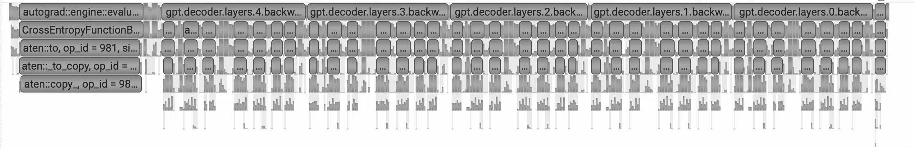

# NVTX Range Functional API 技术文档

## 1. 概述

`nvtx_range_start` 和 `nvtx_range_end` 是一对用于在 PyTorch forward/backward 中标记 NVTX range 的函数。通过在 tensor 上挂载 `torch.autograd.Function`，在 forward 和 backward 执行期间自动生成对应的 NVTX 标记，用于性能分析和可视化。

**设计目的：**
- 在 nsys 时间线中清晰展示 module 的层次结构
- 便于统计各 module 在 forward/backward 阶段的执行时间

---

## 2. 实现原理

### 2.1 核心机制

利用 `torch.autograd.Function` 的特性：
1. **Forward 阶段**：在 module 输入 tensor 上应用 `_NVTXRangeStartFunc`，输出 tensor 上应用 `_NVTXRangeEndFunc`
2. **Backward 阶段**：利用 backward **逆序执行**的特性，`EndFunc.backward` 先于 `StartFunc.backward` 执行

```
Forward:  StartFunc.forward → [...计算...] → EndFunc.forward
Backward: EndFunc.backward  → [...梯度...] → StartFunc.backward
```

### 2.2 NVTX 标记层级

| 位置 | NVTX 层数 | 操作 |
|------|----------|------|
| `StartFunc.forward` | 1层 | `pop()` + `push(name.forward)` + `push("")` |
| `StartFunc.backward` | 2层 | `pop()` + `pop()` + `pop()` + `push("")` + `push("")` |
| `EndFunc.forward` | 1层 | `pop()` + `pop()` + `push("")` |
| `EndFunc.backward` | 2层 | `pop()` + `pop()` + `push(name.backward)` + `push("")` + `push("")` |

> **注意**：push 和 pop 的层数经过精心设计，以平衡 PyTorch 内部自动生成的 NVTX 标记。

---

## 3. 使用方法

### 3.1 基本用法

```python
from megatron.core.utils import nvtx_range_start, nvtx_range_end

class MyModule(nn.Module):
    def forward(self, x):
        # 必须在输入上应用 start，并替换原变量
        x = nvtx_range_start(x, "MyLayer")
        x = self.sub_module(x)
        # 必须在输出上应用 end，并替换原变量
        x = nvtx_range_end(x, "MyLayer")
        return x
```

### 3.2 完整示例（TransformerLayer）

```python
class TransformerLayer(nn.Module):
    def forward(self, hidden_states, ...):
        # 标记 layer 开始
        hidden_states = nvtx_range_start(hidden_states, self.nvtx_name)

        # ... attention + mlp 计算 ...
        output = self.attention(hidden_states, ...)
        output = self.mlp(output, ...)

        # 标记 layer 结束
        output = nvtx_range_end(output, self.nvtx_name)
        return output
```

### 3.3 关键注意事项

**必须替换原变量**

```python
# ✅ 正确
x = nvtx_range_start(x, "name")
...
x = nvtx_range_end(x, "name")

# ❌ 错误
nvtx_range_start(x, "name")  # 返回值未使用
...
nvtx_range_end(x, "name")    # 数据未流经 Function
```

如果不替换原变量，PyTorch 会认为数据**没有流经**这两个 Function，导致 backward 时不会触发对应的 backward 方法，NVTX 标记将无法正确生成。

---

## 4. nsys 时间线效果

下图展示了使用本方案后，backward 阶段的 NVTX 标记效果：



从图中可以观察到：
- `gpt.decoder.layers.N.backward` 范围正确包裹了对应 layer 的 backward 计算
- 各 layer 的 backward 按逆序执行（从高层到低层）
- NVTX 范围与实际的 CUDA kernel 执行对齐

---

## 5. 实现代码

```python
class _NVTXRangeStartFunc(torch.autograd.Function):
    """在 forward 中 push NVTX range, 在 backward 中 pop。"""

    @staticmethod
    def forward(ctx, x, name, phase):
        ctx.name = name
        ctx.phase = phase
        ctx.has_grad = torch.is_grad_enabled() and x.requires_grad
        if _nvtx_enabled:
            torch.cuda.nvtx.range_pop()
            torch.cuda.nvtx.range_push(f"{name}.{phase}")
            torch.cuda.nvtx.range_push(f"")
        return x

    @staticmethod
    def backward(ctx, grad_output):
        # backward 逆序执行，在 backward 末尾 pop
        if _nvtx_enabled:
            torch.cuda.nvtx.range_pop()
            torch.cuda.nvtx.range_pop()
            torch.cuda.nvtx.range_pop()
            torch.cuda.nvtx.range_push(f"")
            torch.cuda.nvtx.range_push(f"")
        return grad_output, None, None


class _NVTXRangeEndFunc(torch.autograd.Function):
    """在 forward 中 pop NVTX range, 在 backward 中 push。"""

    @staticmethod
    def forward(ctx, x, name, phase):
        ctx.name = name
        ctx.phase = phase
        if _nvtx_enabled:
            torch.cuda.nvtx.range_pop()
            torch.cuda.nvtx.range_pop()
            torch.cuda.nvtx.range_push(f"")
        return x

    @staticmethod
    def backward(ctx, grad_output):
        # backward 逆序执行，在 backward 开始时 push
        if _nvtx_enabled:
            torch.cuda.nvtx.range_pop()
            torch.cuda.nvtx.range_pop()
            torch.cuda.nvtx.range_push(f"{ctx.name}.backward")
            torch.cuda.nvtx.range_push(f"")
            torch.cuda.nvtx.range_push(f"")
        return grad_output, None, None


def nvtx_range_start(x: torch.Tensor, name: str, phase: str = "forward") -> torch.Tensor:
    """标记 NVTX range 开始。"""
    return _NVTXRangeStartFunc.apply(x, name, phase)


def nvtx_range_end(x: torch.Tensor, name: str, phase: str = "forward") -> torch.Tensor:
    """标记 NVTX range 结束。"""
    return _NVTXRangeEndFunc.apply(x, name, phase)
```

---

## 6. 限制与未来工作

### 6.1 已知限制

| 问题 | 说明 |
|------|------|
| 性能开销 | Function 挂载带来额外开销，CUDA graph capture 时影响未知 |
| 多输入处理 | 当 module 有多个 tensor 输入时，暂未明确应在哪个 tensor 上应用 Function |
| 无梯度场景 | tensor 不需要梯度时，backward 是否能正常触发 NVTX 标记 |
| recompute 兼容性 | 与 activation checkpointing/recompute 共用时的行为待验证 |

### 6.2 后续计划

- [ ] 评估并优化 CUDA graph capture 场景下的性能开销
- [ ] 明确多输入 module 的处理策略
- [ ] 验证与 recompute 的兼容性
- [ ] 考虑与标准 `nvtx_range_push` / `nvtx_range_pop` API 合并

---

## 7. 参考

- 实现代码：`megatron/core/utils.py:2670-2792`
- 使用示例：`megatron/core/transformer/transformer_layer.py:516-523`
- 相关文档：[nvtx-hooks.md](nvtx-hooks.md) - 解释了为什么不能使用 hook 方案
