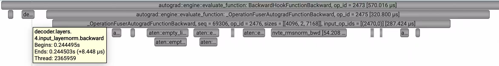
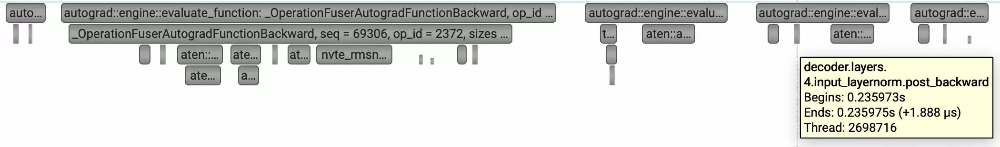

# 通过 Hook 为 Backward 增加 NVTX 标记的技术分析与问题诊断

## 1. PyTorch Backward Hook 实现原理

### 1.1 核心机制

PyTorch 的 `register_full_backward_hook` 和 `register_full_backward_pre_hook` 在底层通过以下组件实现：

1. **`BackwardHookFunction`** (`torch/nn/modules/_functions.py`): 一个透明的 `torch.autograd.Function`，在计算图中创建节点作为 hook 触发点
2. **`BackwardHook`** (`torch/utils/hooks.py`): 包装器类，协调 pre/post hook 的执行
3. **`PyNode`** (`torch/csrc/autograd/python_function.cpp`): C++ 层的节点实现，连接 Python 与 C++ autograd 引擎

### 1.2 埋点过程

在 **forward 阶段**，当模块注册 backward hooks 时：

```python
# torch/nn/modules/module.py
if full_backward_hooks or backward_pre_hooks:
    bw_hook = BackwardHook(self, full_backward_hooks, backward_pre_hooks)
    args = bw_hook.setup_input_hook(args)      # 在输入端埋点
    result = forward_call(*args, **kwargs)
    result = bw_hook.setup_output_hook(result)  # 在输出端埋点
```

**关键机制**：`BackwardHookFunction.apply()` 在输入和输出张量上创建透明的 autograd 节点，这些节点的 `grad_fn` 成为 hook 的注册点。

### 1.3 Backward 执行流程

当调用 `loss.backward()` 时：

```
1. BackwardHookFunctionBackward (输出端)
   └─► 触发 pre-hook（输出梯度可用时）
   
2. Linear/Conv/实际操作的 backward
   └─► 计算输入梯度
   
3. BackwardHookFunctionBackward (输入端)
   └─► 触发 post-hook（输入梯度计算完成后）
```

### 1.4 C++ 层自动 NVTX 标记

PyTorch 的 autograd 引擎在 `evaluate_function` 中自动注入 NVTX 标记：

```cpp
// torch/csrc/autograd/engine.cpp:570-574
RECORD_FUNCTION(
    c10::str("autograd::engine::evaluate_function: ", 
             task.fn_.get()->name()),  // "BackwardHookFunctionBackward"
    ...);
```

这会生成你看到的 `autograd::engine::evaluate_function: BackwardHookFunctionBackward` 标记。

---

## 2. NVTXModuleProfiler 方案分析

### 2.1 原始实现

```python
class NVTXModuleProfiler:
    def _register_backward_nvtx(self, module, name: str) -> None:
        def pre_backward_hook(mod, grad_output):
            nvtx_range_push(f"{name}.backward")  # 在 pre-hook 中 push
            
        def post_backward_hook(mod, grad_input, grad_output):
            nvtx_range_pop(f"{name}.backward")   # 在 post-hook 中 pop

        handle_pre = module.register_full_backward_pre_hook(pre_backward_hook, prepend=True)
        handle_post = module.register_full_backward_hook(post_backward_hook)
```

### 2.2 期望执行顺序

```
pre.backward.nvtx.push ──────► pre.backward.nvtx.pop
                                    │
                                    ▼
                              实际 backward 计算
                                    │
                                    ▼
post.backward.nvtx.push ──────► post.backward.nvtx.pop
```

**理想情况下**，NVTX 范围应该正确包裹模块的 backward 计算。

---

## 3. 问题的根本原因

### 3.1 实际执行顺序（错误）

通过 Nsight Systems 观察到的实际调用顺序：

```
pre.backward.nvtx.push                    # 用户 hook 的 push
    ├─► custom.backward.nvtx.push           # PyTorch 自动标记
    │
    └─► pre.backward.nvtx.pop             # ❌ 错误！用户的 pop 被提前触发
    │
    └─► 实际 backward 计算
    │
    └─► post.backward.nvtx.push           # 用户 hook 的 push
    │
    └─► custom.backward.nvtx.pop          # PyTorch 自动标记结束
    │
    └─► post.backward.nvtx.pop              # ❌ 错误！用户的 pop
```

### 3.2 问题分析

**根本原因**：`BackwardHookFunction` 本身也会生成 NVTX 标记，导致 push/pop 不匹配。

| 标记来源 | push 位置 | pop 位置 |
|---------|----------|---------|
| 用户 hook (`pre_backward`) | pre-hook 开始 | ❌ 实际在 post-hook 前触发 |
| PyTorch 自动 (`evaluate_function`) | `evaluate_function` 入口 | `evaluate_function` 出口 |
| 用户 hook (`post_backward`) | post-hook 开始 | post-hook 结束 |

**问题表现**：
1. 用户的 `pre.backward.nvtx.push` 被 PyTorch 的 `custom.backward.nvtx.pop` 错误地关闭
2. 用户的 `pre.backward.nvtx.pop` 被提前触发，导致范围错乱
3. 从时间线看，`BackwardHookFunction` 的 NVTX 范围错误地包裹了后面的执行代码

### 3.3 图像证据

**图 1: 错误的时间线表现**



从图像可以观察到：
- `autograd::engine::evaluate_function: BackwardHookFunctionBackward` 范围过长
- `decoder.layers.4.input_layernorm.backward`（用户标记）被错误地包含在 PyTorch 的自动标记内
- 实际的 `nvte_rmsnorm_bwd` 计算被包裹在错误的范围内

**关键问题**：由于 `nvtx_range_pop()` 不接收参数，无法验证 push/pop 的内容是否匹配，导致范围错乱难以发现。

---

## 4. 问题验证

### 4.1 验证方法

为了验证 push/pop 的匹配关系，我们在 hook 内部成对调用 NVTX push/pop：

```python
def _register_backward_nvtx(self, module, name: str) -> None:
    def pre_backward_hook(mod, grad_output):
        nvtx_range_push(f"custom.pre.backward")  # 标记 hook 入口
        nvtx_range_push(f"{name}.backward")       # 用户实际标记
        nvtx_range_pop(f"custom.pre.backward")    # 标记 hook 出口
        
    def post_backward_hook(mod, grad_input, grad_output):
        nvtx_range_push(f"custom.post.backward")  # 标记 hook 入口
        nvtx_range_push(f"{name}.backward")       # 用户实际标记
        nvtx_range_pop(f"custom.post.backward")   # 标记 hook 出口
```

### 4.2 验证结果

**图 2: 验证后的时间线**



验证结果显示：
1. `custom.pre.backward` 和 `custom.post.backward` 范围正确嵌套
2. 用户的 `{name}.backward` 范围与 PyTorch 自动标记交错
3. **只有 TE 库定义的组件在 backward 期间产生 NVTX 标记**（如 `nvte_rmsnorm_bwd`）
4. **上层 Megatron 定义的组件不产生 NVTX 标记**，导致无法直观观察 backward 过程

---

## 5. 解决方案

### 5.1 方案 1：调整 Hook 内部的 push/pop 顺序（不推荐）

在 pre-hook 和 post-hook 中手动调整 NVTX 标记：

```python
def pre_backward_hook(mod, grad_output):
    nvtx_range_pop()                          # 弹出 PyTorch 自动的 push
    nvtx_range_push(f"{name}.backward")       # 用户的自定义标记
    nvtx_range_push(f"empty")                 # 占位 push（平衡）
    
def post_backward_hook(mod, grad_input, grad_output):
    nvtx_range_pop()                          # 弹出占位 push
    nvtx_range_push(f"{name}.backward")       # 用户的自定义标记
    nvtx_range_pop()                          # 立即弹出
```

**缺点**：
- ❌ 破坏计算图的完整性
- ❌ 可能干扰 PyTorch 内部的 NVTX 标记管理
- ❌ 难以维护，PyTorch 版本升级后可能失效

观察到，forward hook 会顺序触发，但部分模块，e.g. GPTModel / TransformerBlock /TransformerLayer / ModuleList 等 backward 的 pre-hook 和 post-hook 会连续执行，导致 nsys 结果呈现不直观。目前没有找到为什么。


### 5.2 方案 2：使用自定义 torch.autograd.Function（推荐）

通过自定义 `torch.autograd.Function` 包裹 forward/backward，在 Function 内部管理 NVTX：

```python
class NVTXFunction(torch.autograd.Function):
    @staticmethod
    def forward(ctx, module, name, *args):
        ctx.module = module
        ctx.name = name
        return args
    
    @staticmethod
    def backward(ctx, *grad_outputs):
        nvtx_range_push(f"{ctx.name}.backward")
        # 实际的 backward 计算
        nvtx_range_pop()
        return (None, None) + grad_outputs

# 使用方式
class MyModule(nn.Module):
    def forward(self, x):
        return NVTXFunction.apply(self, self.name, self.fc(x))
```

**优点**：
- ✅ 不依赖 PyTorch 的 hook 机制
- ✅ NVTX 标记完全可控
- ✅ 计算图完整，无副作用
- ✅ 与 PyTorch 版本无关

### 5.3 方案对比

| 方案 | 安全性 | 可维护性 | 复杂度 | 推荐度 |
|-----|-------|---------|-------|-------|
| 方案 1：调整 hook push/pop | 低 | 低 | 低 | ❌ |
| 方案 2：自定义 autograd.Function | 高 | 高 | 中 | ✅ |

---

## 6. 结论

### 6.1 核心问题

PyTorch 的 `register_full_backward_hook` 在底层通过 `BackwardHookFunction` 实现，而该 Function 本身会生成 NVTX 标记。当用户在同一 hook 中再添加 NVTX 标记时，会导致 push/pop 不匹配，产生错误的性能分析时间线。

### 6.2 根本原因

1. **NVTX 的 LIFO 特性**：`nvtx_range_pop()` 不接收参数，只能弹出最近的 push
2. **PyTorch 自动标记与用户标记冲突**：`BackwardHookFunction` 自动生成的标记与用户标记交错
3. **Hook 执行时机复杂**：pre-hook 和 post-hook 在同一 `BackwardHookFunction` 节点上触发，但 C++ 层也有标记

### 6.3 建议

**对于 Megatron 的性能分析**：
1. 避免使用 `register_full_backward_hook` 进行 NVTX 标记
2. 改用自定义 `torch.autograd.Function` 方案
3. 或者使用 PyTorch Profiler（`torch.profiler`）的内置功能，而非手动 NVTX

### 6.4 参考资料

- PyTorch Backward Hook 实现：`torch/utils/hooks.py`, `torch/nn/modules/_functions.py`
- PyTorch Autograd 引擎：`torch/csrc/autograd/engine.cpp`
- NVTX Observer 实现：`torch/csrc/profiler/standalone/nvtx_observer.cpp`

---

*文档版本：v1.0*  
*最后更新：2025-06-02*  
*作者：AI-Infra Team*
