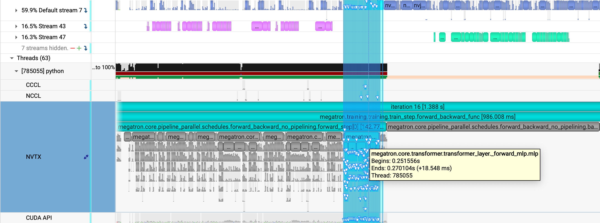

# Fine-Grained Activation Offload: Margin 机制详解

## 1. 背景与问题

在 Pipeline Parallelism 的 1F1B（1 Forward 1 Backward）调度中，激活值的卸载（Offload）和重载（Reload）存在潜在的流水线冲突问题。

### 1.1 Pipeline 执行顺序

```
Forward:  Chunk 0 → Chunk 1 → Chunk 2 → Chunk 3
          Layer 0 → Layer 1 → Layer 2 → Layer 3

Backward: Chunk 3 → Chunk 2 → Chunk 1 → Chunk 0
          Layer 3 → Layer 2 → Layer 1 → Layer 0
```

### 1.2 冲突问题

在 Backward 的最后阶段（处理 Chunk 0/Layer 0）时：
- 如果该 chunk 的激活值被卸载到 CPU，需要从 CPU reload 回 GPU
- **Reload 操作会阻塞计算流**，导致 GPU 空闲等待

**解决方案**：保留最后 X 个 group 在 GPU 上，避免 reload 阻塞。

---

## 2. Offload Margin 机制

### 2.1 核心概念

**Offload Margin** = 每种 group 类型保留在 GPU 上的副本数量。

```python
# fine_grained_activation_offload.py:429-430
# Do not offload the last X groups so that the reloading won't block the computing stream.
self._offload_margin = 0
```

### 2.2 Margin 的计算

Margin 等于一个 chunk 中**去重后的 group 类型数量**：

```python
# fine_grained_activation_offload.py:535-536
self._offload_margin = max(self._offload_margin, chunk.get_max_deduplicated_groups())

def get_max_deduplicated_groups(self):
    """Get the maximum number of deduplicated groups."""
    count_modules = []
    for group in self.offload_groups:
        if group._name not in count_modules:
            count_modules.append(group._name)
    return len(count_modules)
```

### 2.3 为什么需要 "去重"

#### Chunk 内部的 Group 重复

一个 Chunk 包含多个 Layer 的激活值，**每个 Layer 都有相同名称的 groups**。

**示例**：4 Layers，每层 5 个 groups

```
Chunk 0 的 offload_groups:
[
    # Layer 0
    OffloadTensorGroup("attn_norm"),   # 第1个
    OffloadTensorGroup("qkv_linear"),  # 第1个
    OffloadTensorGroup("core_attn"),   # 第1个
    OffloadTensorGroup("attn_proj"),   # 第1个
    OffloadTensorGroup("mlp_norm"),    # 第1个
    
    # Layer 1
    OffloadTensorGroup("attn_norm"),   # 第2个（同名）
    OffloadTensorGroup("qkv_linear"),  # 第2个（同名）
    OffloadTensorGroup("core_attn"),   # 第2个（同名）
    OffloadTensorGroup("attn_proj"),   # 第2个（同名）
    OffloadTensorGroup("mlp_norm"),    # 第2个（同名）
    
    # Layer 2、3 ...（更多重复）
]

总共 20 个 groups，但只有 5 个不同的名称！
```

**去重后**：`["attn_norm", "qkv_linear", "core_attn", "attn_proj", "mlp_norm"]` = **5 个**

所以 `_offload_margin = 5`

---

## 3. 最后一个同名 Group 不卸载

### 3.1 代码逻辑

```python
# fine_grained_activation_offload.py:538-551
# Find the last group with the same name in the cached chunks backward
last_group_with_same_name = {}
for chunk_idx, chunk in enumerate(reversed(self._cached_chunks_backward)):
    for group in chunk.offload_groups:
        last_group_with_same_name[group._name] = group  # 同名会覆盖，保留最后出现的

# Mark the last group with the same name as not offloadable
for name, group in last_group_with_same_name.items():
    if self._offload_margin > 0:
        group.offload = False  # ← 最后一个同名 group 不卸载！
        self._offload_margin -= 1
```

### 3.2 关键机制

#### reversed() 遍历顺序

```python
# _cached_chunks_backward 顺序: [Chunk 0, Chunk 1, Chunk 2, Chunk 3]
# reversed() 后遍历: Chunk 3 → Chunk 2 → Chunk 1 → Chunk 0

for chunk_idx, chunk in enumerate(reversed(...)):
    for group in chunk.offload_groups:
        last_group_with_same_name[group._name] = group  # 覆盖，保留最后遇到的
```

**结果**：每个 group 名称，最终保存的是 **Chunk 0**（最先 backward 的 chunk）中的该 group。

### 3.3 实际效果

```
假设 4 chunks，每个 chunk 有 groups: [attn_norm, core_attn, mlp_norm]

Forward:  Chunk 0 → Chunk 1 → Chunk 2 → Chunk 3
Backward: Chunk 3 → Chunk 2 → Chunk 1 → Chunk 0

reversed() 遍历:
  Chunk 0: attn_norm, core_attn, mlp_norm  ← 最后出现，保留！
  Chunk 1: attn_norm, core_attn, mlp_norm  ← 被覆盖
  Chunk 2: attn_norm, core_attn, mlp_norm  ← 被覆盖
  Chunk 3: attn_norm, core_attn, mlp_norm  ← 被覆盖

last_group_with_same_name:
{
    "attn_norm": Chunk 0 的 attn_norm,
    "core_attn": Chunk 0 的 core_attn,
    "mlp_norm": Chunk 0 的 mlp_norm
}

设置 offload = False:
    Chunk 0 的 attn_norm, core_attn, mlp_norm 不卸载（保留在 GPU）
```

---

## 4. 图示说明

### 4.1 场景描述

下图展示了在有 4 个 micro-batch（Chunk 0-3）的 Pipeline 中，`attn_norm` 和 `mlp_norm` 两个 group 的 offload/reload 情况。



### 4.2 图像解读

**关键观察点**：

1. **Micro-batch 0 的最后一个 Layer**：
   - 没有产生 DtoH（Device to Host）通信
   - 说明该 Layer 的 groups 被标记为 `offload = False`
   - 数据保留在 GPU 上，无需卸载

2. **其他 Layers**：
   - 有 DtoH 通信（蓝色区域）
   - 表示激活值被卸载到 CPU

3. **Backward 阶段**：
   - Micro-batch 0 的最后一个 Layer 的激活值已经在 GPU 上
   - 无需 HtoD（Host to Device）reload
   - 避免了计算流阻塞

### 4.3 为什么 Micro-batch 0 特殊？

```
Pipeline 执行顺序:

Forward:
  Chunk 0 (Micro-batch 0, Layer 0) → Chunk 0 (Layer 1) → ... → Chunk 0 (Layer N)
  Chunk 1 (Micro-batch 1, Layer 0) → ...
  ...

Backward:
  ... → Chunk 0 (Layer N) → ... → Chunk 0 (Layer 1) → Chunk 0 (Layer 0)
```

- **Forward**：Chunk 0 最先执行
- **Backward**：Chunk 0 最后执行（因为是逆序）
- **Chunk 0 的最后一个 Layer**：在 Backward 中最后被访问

因此，保留 Chunk 0 的最后一个 Layer 的 groups 在 GPU 上，可以确保 Backward 最后阶段无需等待 reload。

---

## 5. 总结

| 概念 | 说明 |
|------|------|
| **Offload Margin** | 保留在 GPU 上不卸载的 group 数量 |
| **计算方式** | 去重后的 group 类型数（如 `attn_norm`, `core_attn`, `mlp_norm` 等） |
| **重复原因** | 多个 Layer 有相同名称的 groups（如 Layer 0 和 Layer 1 都有 `attn_norm`） |
| **保留策略** | 每种 group 类型保留最后出现的那个（即最先 backward 的 chunk 中的 group） |
| **目的** | 避免 Backward 最后阶段 reload 阻塞计算流 |

### 核心代码路径

```python
fine_grained_activation_offload.py
├── __init__()
│   └── self._offload_margin = 0  # 初始化
│
├── post_warmup_callback()
│   ├── chunk.get_max_deduplicated_groups()  # 计算 margin
│   ├── self._offload_margin = max(...)        # 设置 margin
│   └── 遍历 reversed(_cached_chunks_backward)
│       └── last_group_with_same_name[group._name] = group  # 保留最后出现的
│
└── 标记不卸载
    └── group.offload = False  # 最后一个同名 group 不卸载
```

### 性能收益

- **减少同步等待**：Backward 最后阶段无需等待 DtoH 完成
- **提高 GPU 利用率**：计算流不会被 reload 阻塞
- **内存权衡**：牺牲少量 GPU 内存（保留的 groups），换取更高的计算效率
